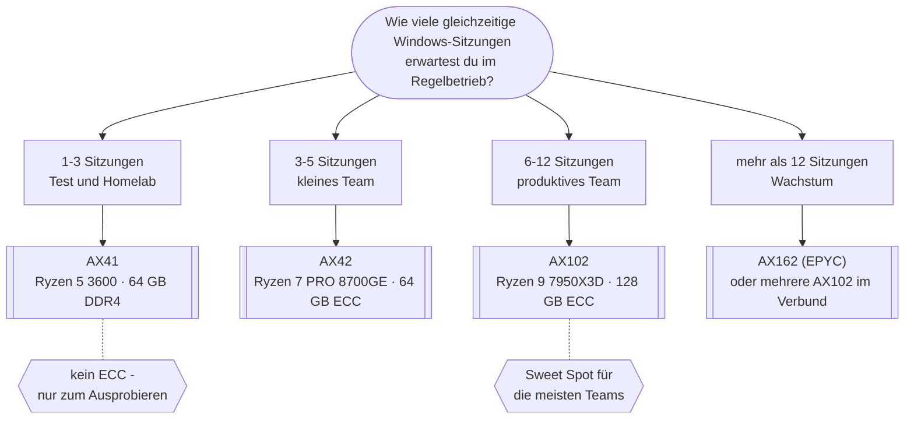

# Server-Empfehlung

Der Proxmox-Host braucht einen **dedizierten (physischen) Server**: Proxmox VE
setzt direkten Zugriff auf die Hardware-Virtualisierung (AMD-V/VT-x) voraus und
läuft auf einer normalen VPS/Cloud-Instanz nur verschachtelt - eingeschränkt und
spürbar langsamer. Root-Server bei **Hetzner** (Deutschland/Finnland) sind dafür
ein bewährter, günstiger Einstieg mit guter EU-Anbindung.

> [!IMPORTANT]
> Modelle, Preise und Verfügbarkeiten bei Hetzner ändern sich laufend (die
> Server-Auktion sogar alle paar Minuten). Alle Zahlen unten sind der Stand
> dieser Anleitung - vor der Bestellung auf
> [hetzner.com/dedicated-rootserver](https://www.hetzner.com/dedicated-rootserver)
> und [hetzner.com/sb](https://www.hetzner.com/sb) (Auktion) gegenprüfen.

---

## TL;DR

| Situation | Modell | Warum |
| --- | --- | --- |
| Toolkit testen, 1-3 Sitzungen | **AX41** | günstigster Einstieg, keine Setup-Gebühr |
| Kleines Team, erster Produktivbetrieb | **AX42** | erstes Modell mit ECC + Zen 4 |
| Produktives Team, 6-12 Sitzungen | **AX102** ⭐ | 16 Zen-4-Kerne, 128 GB ECC, viel Reserve |
| Wachstum, mehr als 12 Sitzungen | **AX162** | EPYC, bis 512 GB ECC - oder mehrere Nodes im Verbund |

---

## Wie viel Rechenleistung brauchst du?

Faustregel: pro **gleichzeitig aktiver** Windows-VDI-Sitzung (nicht pro
Gesamtnutzerzahl) rechnen mit:

| Nutzungsprofil | vCPU/Sitzung | RAM/Sitzung |
| --- | --- | --- |
| Leichte Büroarbeit (Mail, Office, Browser) | 2 | 4 GB |
| Normale Wissensarbeit (mehrere Programme) | 2-4 | 6-8 GB |
| Anspruchsvoll (Entwicklung, viele Programme) | 4 | 8-16 GB |

Dazu die **Grundlast des Hosts**: Proxmox, Kasm (alle Kernkomponenten laut
Kasm-Sizing-Doku), OpenLDAP und Authentik brauchen zusammen rund **4 vCPU und
8 GB RAM**, wenn alles auf einem Server läuft.

> [!NOTE]
> **Beispiel - 5 gleichzeitige Sitzungen (normale Wissensarbeit):**
> 5 × 4 vCPU + 5 × 8 GB = 20 vCPU / 40 GB, plus ~4 vCPU / 8 GB Grundlast
> → Zielgröße **ca. 24 vCPU / 48 GB RAM**.
> vCPUs dürfen moderat überbucht werden (Praxiswert: 25-50 % mehr zugewiesene
> vCPUs als physische Kerne), **RAM nicht**.

---

## Die AX-Modelle auf einen Blick

Preise **inkl. 19 % USt.**, stündliche Abrechnung mit monatlichem Deckel
(`max/Mon.`). Netto ≈ Wert ÷ 1,19.

| Modell | CPU | Kerne/Threads | RAM | NVMe (roh) | Netz | Gleichz. Sitzungen | ab €/Std | max €/Mon. | Setup |
| --- | --- | --- | --- | --- | --- | --- | --- | --- | --- |
| **AX41** | Ryzen 5 3600 · Zen 2 | 6 / 12 | 64 GB DDR4 | 2× 512 GB | 1 GBit/s | 1-3 | 0,1125 € | 70,21 € | **0,00 €** |
| **AX42** | Ryzen 7 PRO 8700GE · Zen 4 | 8 / 16 | 64 GB DDR5 **ECC** | 2× 512 GB | 1 GBit/s | 3-5 | 0,1887 € | 117,81 € | 58,31 € |
| **AX102** ⭐ | Ryzen 9 7950X3D · Zen 4 + 3D V-Cache | 16 / 32 | 128 GB DDR5 **ECC** | 2× 1,92 TB – 2× 7,68 TB | 1 GBit/s | 6-12 | 0,4939 € | 308,21 € | 153,51 € |
| **AX162** | EPYC 9454P · Zen 4 (Genoa) | 48 / 96 | 128–512 GB DDR5 **ECC reg.** | 2× 1,92 TB – 2× 15,36 TB | 1 GBit/s | 15+ | 1,1710 € | 730,66 € | 361,76 € |

Relative Hetzner-Einstufung und Zahl der bestellbaren Hardware-Varianten:

| Modell | Speed[^bars] | Storage-Ausbau[^bars] | Konfig-Varianten |
| --- | --- | --- | --- |
| AX41  | `●●○○○○` | `●●○○○○` | 1 |
| AX42  | `●●●○○○` | `●●●○○○` | 2 |
| AX102 | `●●●●○○` | `●●●●●○` | 4 |
| AX162 | `●●●●●●` | `●●●●●●` | 4 |

[^bars]: `speed` und `storage` sind Hetzners relative Kennzeichnung auf der
    Bestellseite (6 Stufen), keine absoluten Messwerte - sie zeigen nur, wo ein
    Modell innerhalb der AX-Linie einzuordnen ist.

---

## Welches Modell passt?

---

## Modelle im Detail

### AX41 - Test- und Homelab-Einstieg

**Ryzen 5 3600** · 6C/12T · Zen 2 (Matisse) · SMT · AMD-V
64 GB DDR4 (kein ECC) · 2× 512 GB NVMe · 1 GBit/s garantiert
`speed ●●○○○○`  `storage ●●○○○○` · 1 Konfiguration
**0,1125 €/Std**, gedeckelt bei **70,21 €/Mon.** · Setup **0,00 €**

> [!NOTE]
> Ohne ECC-RAM. Reicht, um das Toolkit auszuprobieren und 1-3 Sitzungen zu
> fahren. Für Dauerbetrieb mit mehreren Windows-VMs besser gleich AX42 oder
> größer.

### AX42 - kleines Team, erster Produktivbetrieb

**Ryzen 7 PRO 8700GE** · 8C/16T · Zen 4 (Phoenix) · SMT · AMD-V
64 GB DDR5 **ECC** · 2× 512 GB NVMe · 1 GBit/s garantiert
`speed ●●●○○○`  `storage ●●●○○○` · 2 Konfigurationen
**0,1887 €/Std**, gedeckelt bei **117,81 €/Mon.** · Setup **58,31 €**

> [!TIP]
> Erstes Modell mit ECC-RAM und Zen-4-Kernen - der günstige Einstieg, sobald
> es über reines Testen hinausgeht. RAM ist hier bei 64 GB fix, das begrenzt
> die Sitzungszahl früher als die CPU.

### AX102 - produktives Team ⭐ empfohlen

**Ryzen 9 7950X3D** · 16C/32T · Zen 4 (Raphael) mit **3D V-Cache** · SMT · AMD-V
128 GB DDR5 **ECC** · 2× 1,92 TB bis 2× 7,68 TB Gen4 NVMe (DC-Edition)
1 GBit/s garantiert
`speed ●●●●○○`  `storage ●●●●●○` · 4 Konfigurationen
**0,4939 €/Std**, gedeckelt bei **308,21 €/Mon.** · Setup **153,51 €**

> [!TIP]
> **Empfehlung für die meisten Teams.** 16 Zen-4-Kerne und 128 GB ECC decken
> rund 6-8 komfortable Sitzungen samt Grundlast (Proxmox, Kasm, Authentik) ab,
> mit Reserve nach oben. Datacenter-NVMe mit hoher Ausdauer.

### AX162 - Wachstum / größere Teams

**EPYC 9454P** · 48C/96T · Zen 4 (Genoa) · SMT · AMD-V
128 GB bis 512 GB DDR5 **ECC reg.** · 2× 1,92 TB bis 2× 15,36 TB NVMe (DC-Edition)
1 GBit/s garantiert
`speed ●●●●●●`  `storage ●●●●●●` · 4 Konfigurationen
**1,1710 €/Std**, gedeckelt bei **730,66 €/Mon.** · Setup **361,76 €**

> [!NOTE]
> EPYC-Plattform mit bis zu 512 GB registriertem ECC. Ab dieser Größe lohnt
> der Vergleich mit **mehreren AX102 im Verbund**: Kasm verteilt Sitzungen
> automatisch über mehrere Agents, und mehrere Nodes bringen zusätzliche
> Ausfallsicherheit.

---

## Konkrete Empfehlung

- **Ausprobieren / Kennenlernen** (1-3 gleichzeitige Sitzungen):
  **AX41** - oder ein vergleichbares Modell aus der Server-Auktion.
- **Produktiver Einsatz im kleinen Team** (bis ~8 gleichzeitige Sitzungen bei
  normaler Wissensarbeit): **AX102** - 16C/32T und 128 GB ECC bieten Spielraum
  inklusive Grundlast. Der Preis-Sprung zum AX42 lohnt sich, sobald 64 GB RAM
  eng werden.
- **Wachstum bzw. mehr als 10 gleichzeitige Sitzungen**: **AX162** (EPYC, bis
  512 GB) **oder** mehrere kleinere Server im Verbund (mehrere Proxmox-Nodes,
  Kasm verteilt automatisch).

---

## Immer sinnvoll, unabhängig vom Modell

> [!TIP]
> - **Separater kleiner Server / VM für Kasm selbst** (Web-App-Rolle), getrennt
>   vom Proxmox-Host. Laut Kasm-Sizing reichen dafür wenige vCPUs und ein paar
>   GB RAM - es sei denn, Kasm soll auch selbst Container-Sitzungen hosten.
> - **Hetzner Storage Box** (günstiges Netzlaufwerk) als Ziel für die
>   persönlichen Nutzer-Netzlaufwerke (offener Punkt in der Haupt-README).

---

## Server-Auktion als Alternative

> [!TIP]
> Die **Hetzner Server-Auktion** ([hetzner.com/sb](https://www.hetzner.com/sb))
> listet gebrauchte/generalüberholte Server mit ähnlichen oder besseren Specs
> oft deutlich günstiger (Richtwert: ab ~39 €/Mon.) und **ohne Setup-Gebühr**.
> Nachteil: wechselndes Angebot, teils ältere Hardware, keine feste
> Modell-Zusage.

---

## Bestellhinweise

- **Keine Mindestvertragslaufzeit** bei AX-Line-Neugeräten - jederzeit kündbar.
  Gut, um klein zu starten und später auf ein größeres Modell umzuziehen.
- **Abrechnung stündlich mit Monatsdeckel** (`max/Mon.`). Eine **einmalige
  Setup-Gebühr** fällt ab AX42 an; **AX41 ist ohne Setup-Gebühr**.
- Bei der **Server-Auktion**: keine Einrichtungsgebühr, dafür wechselndes
  Angebot und ggf. ältere Hardware.
- Installation danach über das **Rescue-System / `installimage`** in Robot
  (siehe [`SETUP.md`](SETUP.md), Abschnitt Server-Vorbereitung).
- **Preis-Richtwerte** (inkl. USt., Stand dieser Anleitung): neue AX-Line ab
  **~0,11 €/Std bzw. ~70 €/Mon.** (AX41), Auktionsserver ab **~39 €/Mon.**
  Aktuelle Preise immer direkt bei Hetzner prüfen.
